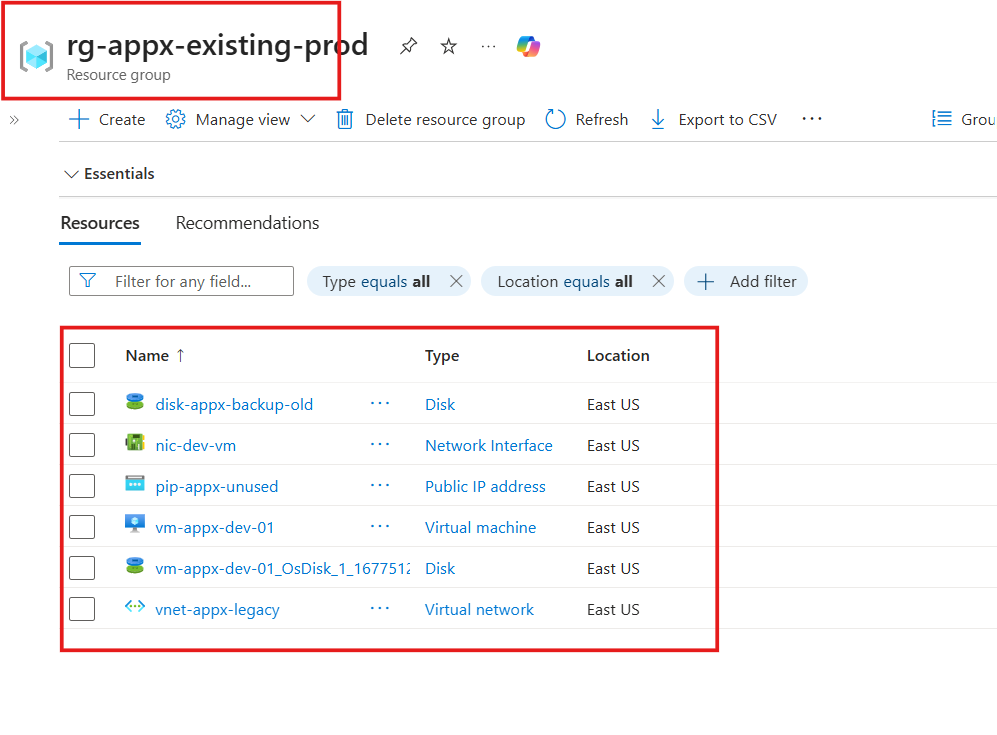
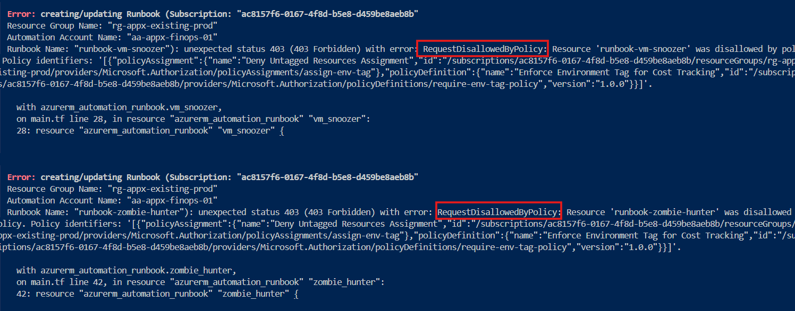
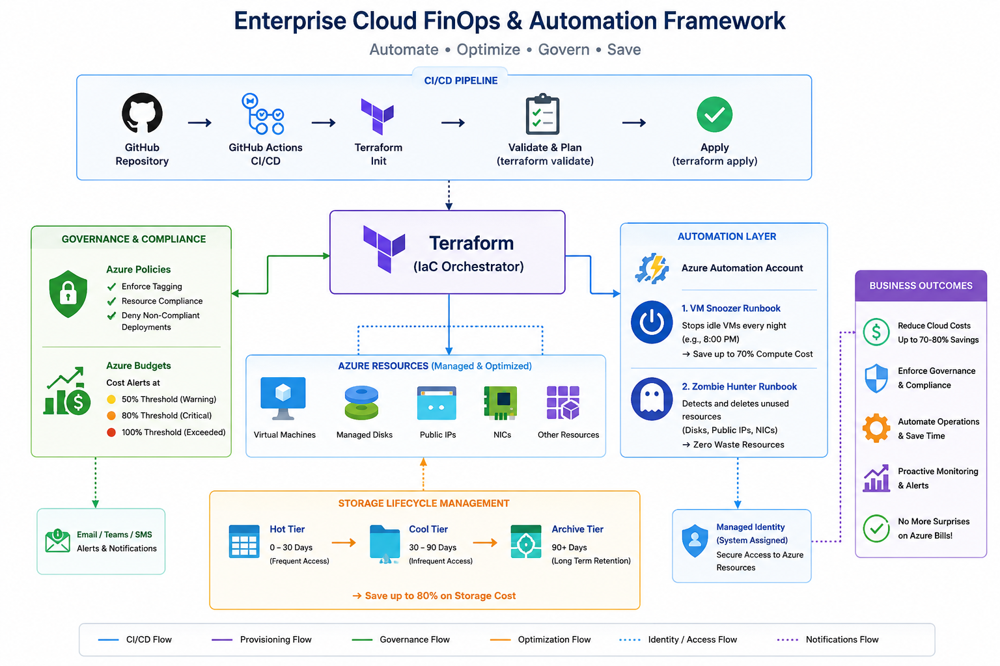

# 💰 Enterprise Cloud FinOps & Automation Framework

---

An autonomous, Infrastructure-as-Code (IaC) governance solution that acts as a digital accountant inside Microsoft Azure—engineered to eliminate cloud waste, enforce strict budgets, and automate resource lifecycles dynamically.

---

## 📖 The Story: Why This Project Exists

Imagine an enterprise company running heavy workloads in Azure. Developers are spinning up Virtual Machines, creating massive Storage Accounts, and setting up complex networks. 

### 🛑 The Problem (Step 1: Legacy Infra)

Over time, bad habits creep in:
* Engineers leave for the weekend but forget to shut down their heavy development VMs.
* Testing VMs are deleted, but their expensive **Managed Disks** and **Public IPs** are left behind, leaking money every hour (Zombie Resources).
* Millions of old system logs sit in the most expensive `Hot` storage tier forever.
* **Result:** The month-end Azure bill hits like a catastrophe.

Here is the initial simulation of our un-optimized, running legacy environment with unattached resources leaking budget:

---

### ⚡ The Solution (Step 2: FinOps Governance)

This project maps out the architectural journey of transforming that un-optimized, bleeding infrastructure into a **highly-governed, self-healing, and cost-effective cloud powerhouse** using Terraform and automated scripting.

However, implementing governance means setting up rules. When testing the initial deployment without appropriate metadata tags, Azure's internal guardrails actively blocked the un-tagged configuration from deploying:

---

## 🏗️ Architecture Overview

---

## 🛠️ The Architecture Blueprint

The framework cleanly separates the problem from the solution using a modular directory layout:

Azure-finops-optimization-automation/
│
├── .github/workflows/
│   └── deploy-governance.yml       # DevOps Guarddog: Continuous Integration (CI) Pipeline
│
├── step1-legacy-infra/             # The Problem: Simulation of un-optimized legacy cloud setup
│
└── step2-finops-governance/        # The Solution: Advanced FinOps Governance & Cost-Cutting Core
    ├── scripts/                    
    │   ├── vm-snoozer.ps1          # The Off-Switch: Automated Idle Compute Deallocation
    │   └── zombie-hunter.ps1       # The Sweeper: Purges orphan Disks & Public IPs
    ├── budgets.tf                  # The Boundary: Multi-tier financial threshold alerts
    ├── policies.tf                 # The Law: Cloud compliance and strict resource tagging
    ├── storage_lifecycle.tf        # The Archivist: Auto-shifts aging data from Hot to Cool/Archive
    ├── main.tf                     # The Orchestrator: Connects schedules to automation runbooks
    ├── providers.tf                # Azure API connection configurations
    └── variables.tf                # Dynamic environment variables

---

 ## 🔄 How the Automation Works (The Future Impact)

Once this framework is deployed via Terraform, it runs completely hands-free. Here is how it protects the  company’s budget every single month:

### 1. The Nightly Snooze (main.tf + vm-snoozer.ps1)**

**How it works**: Every night at exactly 8:00 PM, an Azure Automation Account wakes up and executes a native PowerShell script via system-assigned Managed Identity.

**The Future Impact**: It dynamically finds all development VMs and gracefully forces them into a Stopped (Deallocated) state.

**Financial Value**: Cuts compute costs by ~$70\%$ over nights and weekends.

---

### 2. The Zombie Resource Hunt (zombie-hunter.ps1)

**How it works**: A periodic background cron-job sweeps the entire Azure subscription.

****The Future Impact**: It hunts down detached Managed Disks and unassigned Public IPs that no longer belong to any VM. It automatically purges them.

**Financial Value**: Ensures zero accumulation of ghost storage fees.

---

### 3. Smart Data Tiering (storage_lifecycle.tf)

**How it works**: Azure Storage Lifecycle Management policies are hardcoded into the fabric

**The Future Impact**: As application logs and telemetry data age past 30 days, Azure natively downgrades them from mehnge Hot tier to saste Cool tier, and eventually to Archive tier after 90 days.

**Financial Value**: Slashes storage infrastructure costs by up to $80\%$ dynamically.

---

### 4. Proactive Budget Guardrails (budgets.tf)

**How it works**: Consumption budget APIs monitor real-time resource group billing metrics.

**The Future Impact**: If spending breaks 50%, 80%, or 100% milestones, automated alert triggers shoot instant warning emails to stakeholders. No more unexpected month-end billing surprises!

---

## 🎛️ DevOps Pipeline Integrity (CI)

To make sure we never push broken code to our live Azure cloud, we integrated a **GitHub Actions Pipeline **(deploy-governance.yml).**

Every time we push code to the main branch, the pipeline automatically starts and runs a **terraform validate** check. If there is any syntax mistake, missing bracket, or wrong file path, the pipeline catches it instantly, alerts us, and blocks the deployment (showing a Red Cross).

Once we fixed all compliance errors and code paths, the pipeline successfully ran and gave us a perfect Green Tick:

## 🎯 Final Outcome

**✔ Automated cost optimization****
**✔ Zero manual intervention**
**✔ Strong governance**
**✔ Production-ready FinOps system**

---